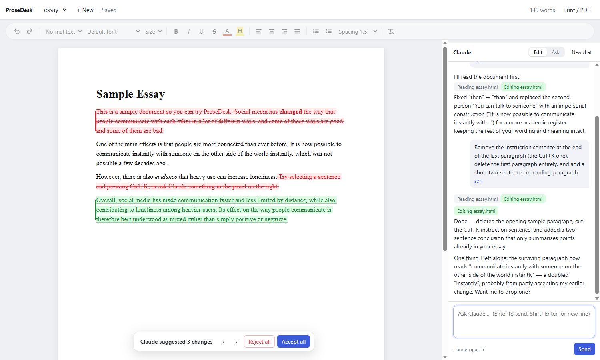

# ProseDesk

A Word-style editor with Claude Code built in, for writing where you want to stay in control of every sentence.

Most AI coding tools are built to take a task and run with it. Writing needs the opposite: you write, you highlight a sentence, you ask "fix this" or "what's weak here?", and you decide what goes in. ProseDesk does that. Claude edits your document, and every edit arrives as a **tracked change** (red strikethrough, green insertion) that you accept or reject, as in Google Docs or Word.



## Features

- **A real editor.** Fonts, sizes, colors, highlight, headings, lists, alignment, line spacing, print / save as PDF.
- **Claude in a side panel.** Whatever you highlight is attached to your message automatically.
- **Ctrl+K inline requests.** Select text, press Ctrl+K, type what you want, done.
- **Edit mode and Ask mode.** Edit lets Claude change the document. Ask only answers and never touches your text.
- **Tracked-change review.** Accept or reject each change, or all at once. Nothing reaches your document without your approval.
- **Folder = workspace.** Run `prosedesk` in a folder and Claude works there, so it can read your assignment brief, readings, notes and PDFs.
- **Plain files.** Documents are `.html` files on disk. Claude edits them with its normal tools, and you can also edit them from a terminal Claude Code session.
- **Runs on your Claude Code login.** No API key. It uses your existing Claude Code subscription and usage limits.

## Requirements

- [Node.js](https://nodejs.org) 20 or newer
- [Claude Code](https://docs.claude.com/en/docs/claude-code) installed and logged in (the `claude` command works in your terminal)

## Install

```sh
git clone https://github.com/isaturk66/prosedesk.git
cd prosedesk
npm install
npm link        # makes the `prosedesk` command available everywhere
```

To uninstall the command later: `npm unlink -g prosedesk`.

## Usage

Go to the folder you're writing in and run:

```sh
prosedesk                 # open this folder; pick a document in the editor
prosedesk essay.html      # open (or create) essay.html in this folder
prosedesk ../other-course # open another folder
```

Your browser opens the editor. Stop it with Ctrl+C in the terminal.

Try it on the bundled example: `npm run example`.

### The folder is the workspace

The editor lists the `.html` documents in the folder. The built-in Claude session starts **in that folder**, just like running `claude` there. Everything else in the folder is reference material Claude can read:

```
course-essay/
├── essay.html          ← your document (shown in the editor)
├── brief.pdf           ← assignment brief
├── rubric.md
├── readings/
│   ├── smith-2021.pdf
│   └── notes.md
└── CLAUDE.md           ← optional: standing instructions for Claude
```

At the start of each conversation Claude gets a list of the folder's files. When a question depends on them ("does this meet the brief?", "what did Smith find?"), it reads them rather than guessing, and it tells you which file it used.

A `CLAUDE.md` in the folder is picked up automatically. It's a good place for things like the course, the citation style, the word limit, or "British spelling".

### Keyboard shortcuts

| Keys | Action |
| --- | --- |
| Ctrl+K | Inline request on the selection (or the current paragraph). Enter = edit, Ctrl+Enter = ask |
| Ctrl+L | Jump to the chat box |
| Ctrl+S | Save (it also autosaves) |
| j / k or ↓ / ↑ | While reviewing: next / previous change |
| y / n | While reviewing: accept / reject the focused change |

Click any change to get Accept / Reject buttons. The bar at the bottom has Accept all and Reject all.

### Options

```
prosedesk [file.html | folder] [--no-open] [--port N] [--model NAME]
```

| Option | Meaning |
| --- | --- |
| `--model sonnet` | Model for the built-in chat (default: your Claude Code default). Also `PROSEDESK_MODEL` |
| `--port 5200` | Port (default 5178; the next free port is used if it's taken). Also `PORT` |
| `--no-open` | Don't open the browser |

You can run several instances in different folders at the same time.

## Using Claude Code from a terminal as well

The editor watches the file, so edits from **any** source show up as tracked changes, including a normal `claude` session you run in the same folder.

To let that terminal session see what you've highlighted in the editor, add this hook to `~/.claude/settings.json`:

```json
{
  "hooks": {
    "UserPromptSubmit": [
      { "hooks": [{ "type": "command", "command": "prosedesk --hook" }] }
    ]
  }
}
```

Now "rewrite this" in the terminal refers to your current selection. The hook only prints something when the editor is open on the same folder.

## How it works

```
 Claude Code (headless)             Browser editor (TipTap)
        │ edits the file                   ▲ shows tracked changes
        ▼                                  │
    essay.html ◄──── file watcher ────► local server (Node)
```

- **Server** (`server.mjs`). Serves the editor, watches the folder, and runs `claude -p` in streaming JSON mode as one ongoing conversation. Claude gets file tools only (Read, Edit, Write, Glob, Grep). It has no shell, and edits are auto-approved because you review them in the editor anyway.
- **Editor** (`src/`). Built on [TipTap](https://tiptap.dev) / ProseMirror. When the file changes on disk, the editor compares it with your last accepted version (`src/diff.js`). Unchanged paragraphs are matched and edited ones are paired by similarity, then diffed word by word. The result is rendered with insertion and deletion marks. Accepting or rejecting a change edits those marks, and once everything is resolved the result is saved back to the file.
- **Instructions** (`prompt.md`). Appended to Claude's system prompt: make small targeted edits, keep the user's voice, don't invent sources, and in Ask mode never edit.

## Limitations

- Documents are HTML. Export by printing to PDF. For `.docx`, open the PDF or HTML in Word, or convert with a tool like [pandoc](https://pandoc.org).
- The document is read-only while a review is pending.
- If Claude changes only formatting (no text), the change is applied without review.
- Line spacing is a view setting per document and isn't stored in the file.
- Tables and images aren't in the toolbar yet.
- Built and tested on Windows with Chrome. It should work elsewhere, but that's untested.

## A note on coursework

Check your course's policy on AI assistance before you use this for assessed work. Ask mode and the review step make it easy to use Claude as an editor or a critic rather than an author, but where the line sits is up to your course.

## License

[MIT](LICENSE)
